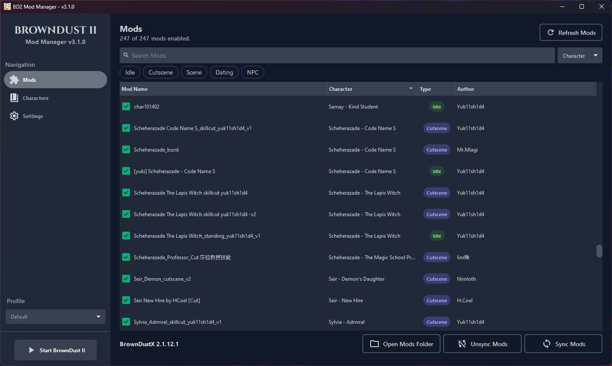
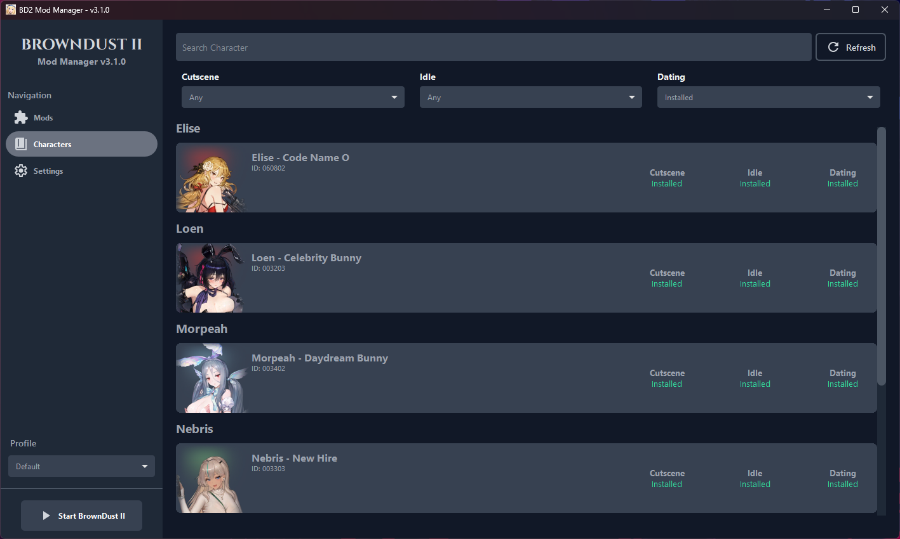

# Brown Dust 2 Mod Manager

---

**Easily manage your Brown Dust 2 mods.**

> 🎉 **Download the latest version:** [GitHub Releases](https://github.com/bruhnn/BD2ModManager/releases)

If you have suggestions or run into any problems with the app, feel free to open an issue or contact me.

---
## 🔥 What's New in v3.0.0

- New UI design (still a WIP, expect changes).
- Mod Profiles to quickly switch between different setups.
- Preview mods spine ani   mations.
- Filter mods by status directly on the characters page.
- Finds your game installation automatically.
- New characters are added automatically, no more manual updates.
- Language support (auto-translated, so might not be perfect).

## ✨ Features

- Search mods by name, character, author, or type
- One-click install (symlink or copy)
- Drag-and-drop to install new mods
- Enable/disable mods with a single click
- Easily view which characters have each mod type enabled on the characters page
- Edit `.modfile` JSON data directly inside the app

---

## 🛠️ How to Use

1. **Download** the app from [GitHub Releases](https://github.com/bruhnn/BD2ModManager/releases).
2. **Select your Brown Dust 2 directory** (where `BrownDust II.exe` is located)
   - Example: F:\Neowiz\Browndust2\Browndust2_10000001
3. **Add your mods** by:
   - Dragging and dropping them into the Mod Manager  
   - Or moving them into the `mods/` folder  
     ⚠️ **Note:** This is *not* the BrownDustX `mods` directory. It's a separate folder used by this manager

4. **Enable or disable mods**.
5. **Sync your mods** to apply changes:
   - This will create a folder named `BD2ModManager` inside the `BrownDustX` mods folder with all your enabled mods.

> ⚠️ After making any changes (enable, disable, delete, rename), you **must sync** your mods to update the game folder.

### Sync Method: Copy vs Symlink

Choose how mods are synced to your BrownDust X `mods` folder:

#### 📁 Copy
Copies all enabled mods into the folder.

- ✅ Works everywhere
- ✅ No admin rights needed
- ❌ Slower and uses more disk space

#### 🔗 Symlink
Creates shortcuts instead of copying files.

- ✅ Much faster, saves space
- ❌ Requires admin rights

### Example Comparison with 200 mods

| Copy | Symlink |
|--------|-------|
|  |  |

---

## 📸 Screenshots

### Mods Page (v3.1.0)

### Characters Page (v3.1.0)

---

---
## 🧰 Other Tools

If you're looking for alternatives, check out this manager by [kxdekxde](https://github.com/kxdekxde/browndust2-mod-manager)

## Credits

- Character assets by [myssal/Brown-Dust-2-Asset](https://github.com/myssal/Brown-Dust-2-Asset)
- Thanks to **Synae** for *Brown Dust X*

