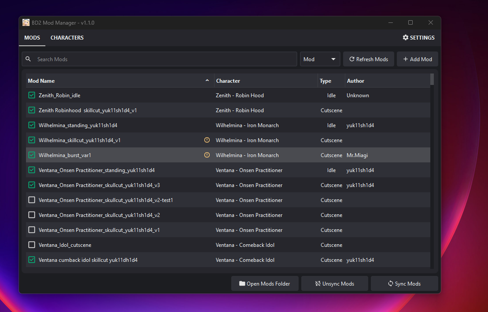

## Brown Dust 2 Mod Manager

Manage your Brown Dust 2 mods.

---

Download here: [Github Releases](https://github.com/bruhnn/BD2ModManager/releases)

---

If you have any problems or ideas, feel free to contact me on Discord: @bruhnnn

---

## Features

- Simple drag-and-drop mod installation  
- Enable or disable mods with a click  
- Search installed mods quickly  
- Check which characters have a specific mod type installed  

---

## How to Get Started

1. Download the app.  
2. Select your Brown Dust 2 game directory.  
3. Add your mods by dragging and dropping them into the manager or moving into `mods` folder.  
4. Enable or disable mods.
5. Make a backup of your mods.
6. Sync your mods. This will create a folder named `BD2MM` inside the `BDX` mods folder with all your enabled mods.

---

## Screenshots

### Mods Page v1.1.0
  

### Characters Page v1.1.0

---

### Credits
- Characters assets by https://github.com/myssal/Brown-Dust-2-Asset
- Thanks to Synae for Brown Dust X