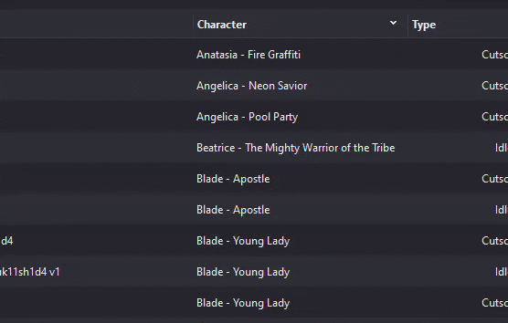
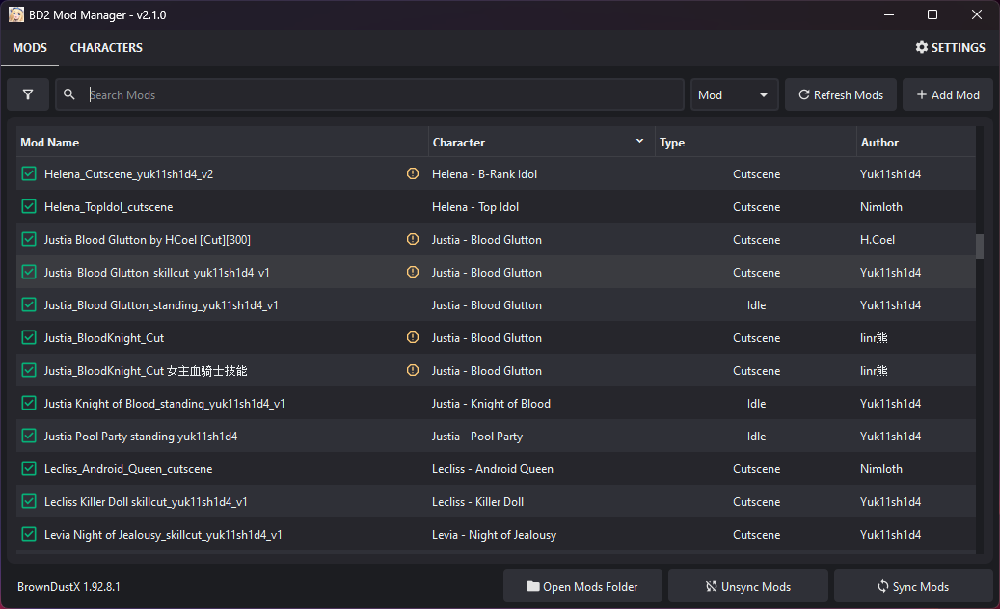

# Brown Dust 2 Mod Manager

**Easily manage your Brown Dust 2 mods.**

---

**Download:** *[BD2ModManager on GitHub Releases](https://github.com/bruhnn/BD2ModManager/releases)*

*If you have any questions or suggestions, contact me on Discord: `@bruhnnn`*

---
## 🔥 New in v2.2.0
- Remembers and restores **window size and position**
- Supports installing **.zip mods** (via drag-and-drop)
- Fixed: **"Find Authors"** now works better (still experimental, only works for some mods and only if the mod folder hasn’t been modified)
- You can now **edit `.modfile` JSON** directly in the manager 
→ Right-click a mod and select **"Edit Modfile"**

## ✨ Features

- Quick mod search
- Filter by mod name, character, author, or mod type
- Copy mods into the game folder with one click (symlink supported)
- Simple drag-and-drop mod installation
- Enable or disable mods with one click
- Check which characters have a specific mod type installed
- Check if a mod conflict with anothers (need to refresh the mod list if enabled a mod to see)

---

## 🛠️ How to Use

1. **Download** the app from [GitHub Releases](https://github.com/bruhnn/BD2ModManager/releases).
2. **Select your Brown Dust 2 directory** (where `browndust 2.exe` is located)
   - Example: F:\Neowiz\Browndust2\Browndust2_10000001
3. **Add your mods** by:
   - Dragging and dropping them into the Mod Manager  
   - Or moving them into the `mods/` folder  
     ⚠️ **Note:** This is *not* the BrownDustX `mods` directory. It's a separate folder used by this manager

4. **Enable or disable mods**.
5. **Sync your mods** to apply changes:
   - This will create a folder named `BD2MM` inside the `BDX` mods folder with all your enabled mods.

> ⚠️ After making any changes (enable, disable, delete, rename), you **must sync** your mods to update the game folder.

### Sync Method: Copy vs Symlink

Choose how mods are synced to your BrownDust X `mods` folder:

#### **Copy**
Copies all enabled mods into the folder.

- ✅ Works everywhere
- ✅ No admin rights needed
- ❌ Slower and uses more disk space

#### 🔗 Symlink
Creates shortcuts instead of copying files.

- ✅ Much faster, saves space
- ❌ Requires admin rights

### Example Comparison with 200 mods

| Copy | Symlink |
|--------|-------|
|  |  |

---

## 📸 Screenshots

### Mods Page (v2.2.0)

### Characters Page (v2.2.0)

---

## Credits

- Character assets by [myssal/Brown-Dust-2-Asset](https://github.com/myssal/Brown-Dust-2-Asset)
- Thanks to **Synae** for *Brown Dust X*

