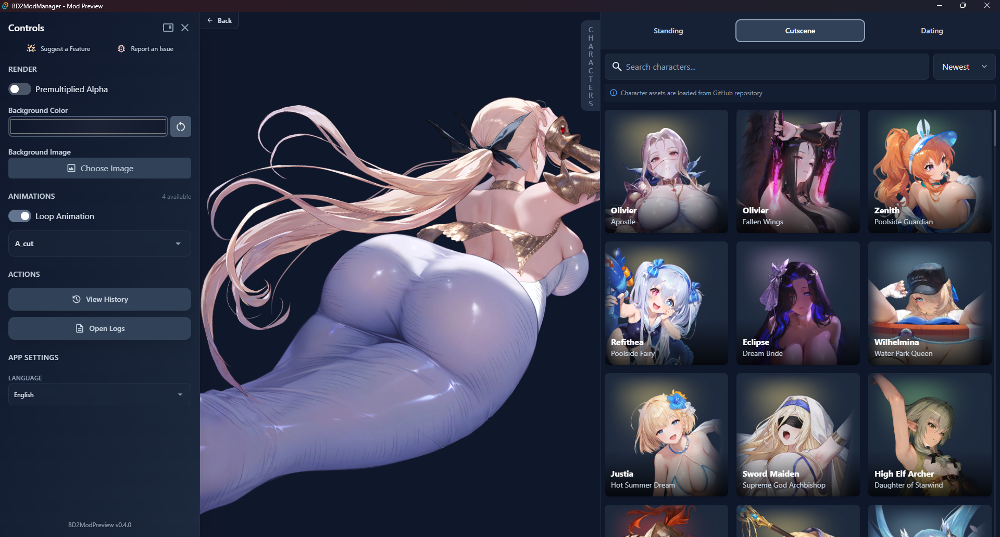

# Brown Dust 2 Mod Manager

> 🛠 Easily manage, preview, and sync mods for Brown Dust 2.
> 
> 🎉 **Download the latest version:** [GitHub Releases](https://github.com/bruhnn/BD2ModManager/releases/latest)

If you have suggestions or run into any problems with the app, feel free to open an issue or contact me.

---
## ✨ New version of BD2ModPreview v0.4.0

- Added Home Page with recent folders
- Added sidebar controls (switch between floating and sidebar)
- Character List improvements:
  - Added sorting options (newest, oldest, A-Z, Z-A)
  - Improved asset loading with CDN for better performance
- Added language support:
  - Chinese (cn)
  - Japanese (ja)

> The mod manager will automatically update BD2ModPreview.  
> If you see a notification that BD2ModPreview is updating, please **do not preview any mods** until the update completes.

---

## 🔥 What's New in v3.2.3

- ✨ Added full Chinese (zh-CN) translation (requested by [@moxue128](https://github.com/moxue128))
- 🐞 Fixed missing UI text translations for:
  - 🇧🇷 Portuguese (pt-BR)
  - 🇯🇵 Japanese (ja-JP)
  - 🇰🇷 Korean (ko-KR)
  - 🇨🇳 Chinese (zh-CN)

  

      🔥 What's New in v3.2.2
  

  
  - **Updated BD2ModPreview to v0.3.0** [See Screenshot](#mod-preview-bd2modpreview-v030)
    - ✨ Load original character Spine animations directly from GitHub assets
    - ✨ Added Spine folder history feature
    - ✨ Added option to download missing skeleton files from the mod folder (requested by [@CalbeeDaLock](https://github.com/CalbeeDaLock))
  - 🐛 Fixed Spine animations not working because of Korean characters in atlas (reported by [@Love-156](https://github.com/Love-156))
  - :sparkles: BD2ModPreview now automatically updates when a new version is available
  - ✨ App update notifications now appear in a pop-up
  - 🐞 Collaboration characters now display as **"Unavailable"** on the characters page (requested by [@CalbeeDaLock](https://github.com/CalbeeDaLock))

## ✨ Features

- **Mod Profiles:** Create and manage different mod setups and switch between them.
- **Mod Previews:** Double-click any mod to preview its Spine animations.
- **Automatic Game Detection:** The manager automatically finds your Brown Dust 2 installation.
- **Automatic Content Updates:** New characters and assets are added automatically, eliminating manual updates.
- **Multi-Language Support:** Available in Portuguese (pt-BR), Japanese (ja-JP), and Korean (ko-KR) (auto-translated, so might not be perfect).
- Search mods by name, character, author, or type.
- Filter mods by status directly on the characters page.
- One-click install to game folder (symlink or copy).
- Drag-and-drop to install new mods.
- Enable/disable mods with a single click.
- Easily view which characters have each mod type enabled on the characters page.
- Edit `.modfile` JSON data directly inside the app.

---

## 🛠️ How to Use

1. **Download** the app from [GitHub Releases](https://github.com/bruhnn/BD2ModManager/releases).
2. **Select your Brown Dust 2 directory** (where `BrownDust II.exe` is located)
   - Example: F:\Neowiz\Browndust2\Browndust2_10000001
3. **Add your mods** by:
   - Dragging and dropping them into the Mod Manager  
   - Or moving them into the `mods/` folder  
     ⚠️ **Note:** This is *not* the BrownDustX `mods` directory. It's a separate folder used by this manager

4. **Enable or disable mods**.
5. **Sync your mods** to apply changes:
   - This will create a folder named `BD2MM` inside the `BrownDustX` mods folder with all your enabled mods.

> ⚠️ After making any changes (enable, disable, delete, rename), you **must sync** your mods to update the game folder.

### Sync Method: Copy vs Symlink

Choose how mods are synced to your BrownDust X `mods` folder:

#### 📁 Copy
Copies all enabled mods into the folder.

- ✅ Works everywhere
- ✅ No admin rights needed
- ❌ Slower and uses more disk space

#### 🔗 Symlink
Creates shortcuts instead of copying files.

- ✅ Much faster, saves space
- ❌ Requires admin rights

### Example Comparison with 359 mods

| Copy | Symlink |
|--------|-------|
|  |  |

---

## 📸 Screenshots

### Mods Page (v3.1.0)

### Characters Page (v3.1.0)

### Mod Preview (BD2ModPreview v0.3.0)

---
## 🧰 Other Tools

If you're looking for alternatives, check out this manager by [kxdekxde](https://codeberg.org/kxdekxde/browndust2-mod-manager)

## ❓ FAQ

### Where can I get mods?
You can find mods on the BrownDustX Discord server: [https://discord.gg/B3Aqz6tDG2](https://discord.gg/B3Aqz6tDG2)

### Why is the `.exe` flagged as a virus?
This is a **false positive** caused by how PyInstaller packages apps. The program does **not** contain any malware.  
If you're unsure, you can check the [source code](https://github.com/bruhnn/BD2ModManager) and build the `.exe` yourself.

### Can I use the app on Linux or macOS?
Currently, BD2ModManager is only tested and built for **Windows**. No official builds for Linux or macOS are available yet.

### What's the difference between the `.exe` and the `*-Full.zip` version?
- The `.exe` is a standalone, single-file version.
- The `*-Full.zip` is the **full version**, containing all required files and less likely to trigger false positives. It's recommended if you run into issues with the single `.exe`.

### How can I contribute to BD2ModManager's development?
You can contribute by:

- ⭐ Starring the project on GitHub to show your support.
- 🐛 Reporting bugs and suggesting features via [GitHub Issues](https://github.com/bruhnn/BD2ModManager/issues).
- 👩‍💻 If you're a developer, fork the repository and submit pull requests with improvements or bug fixes.

## 🤝 Credits

- Character assets by [myssal/Brown-Dust-2-Asset](https://github.com/myssal/Brown-Dust-2-Asset)
- Thanks to **Synae** for *Brown Dust X*

## Star History

<a href="https://www.star-history.com/#bruhnn/BD2ModManager&Date">
 <picture>
   <source media="(prefers-color-scheme: dark)" srcset="https://api.star-history.com/svg?repos=bruhnn/BD2ModManager&type=Date&theme=dark" />
   <source media="(prefers-color-scheme: light)" srcset="https://api.star-history.com/svg?repos=bruhnn/BD2ModManager&type=Date" />
   
 </picture>
</a>
